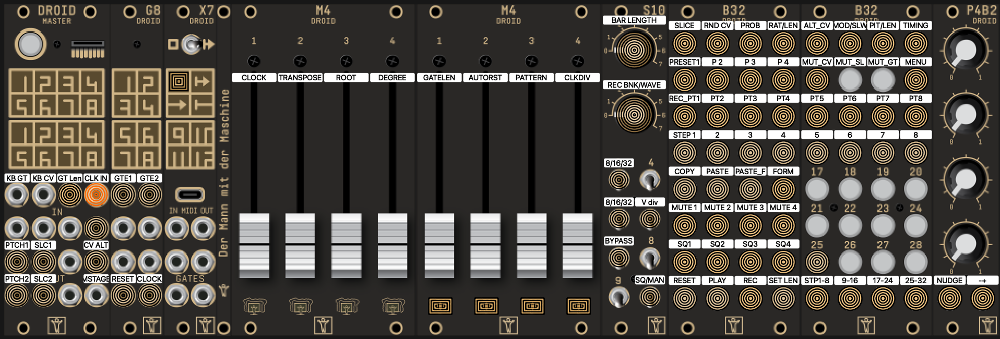

# droid-assimilor-patch
Droid patch for slicing and sequencing a 1 bar drum loop on Assimil8or and a M4.
It provides 16 slices of a 1 bar drumloop using the M4 notches to select a sample for each of the 16 steps.
Besides a main swing groove using the pots, it has 2 tracks with also an added timing page to adjust the groove of each 4 16th steps in each quarter note.
You can also use the M4 to sequence your presets for each drum sequencer and use the switch between the sequence or manual mode, similar as the ER101.

