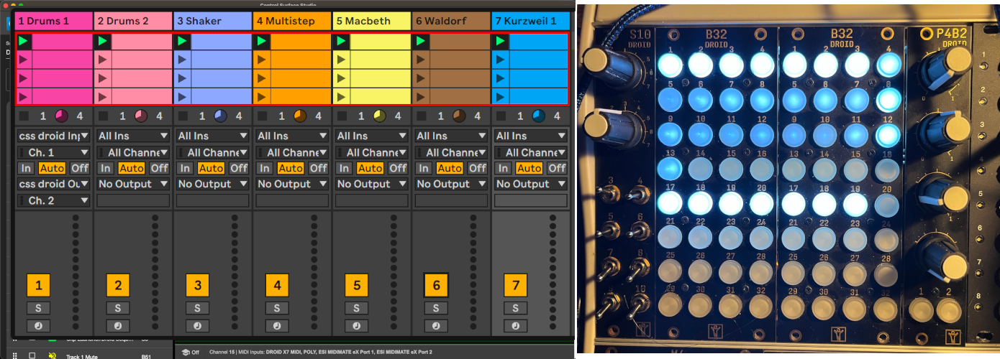

# droid-ableton-controller

Droid Ableton controller with use of https://remotify.io

### How to use ###
Best way to use this is to buy a copy of remotify.io and import the 1_script.json and controller.json as a starting point to create your own.

### How to install ###
open and install the ableton controller v1.ini file to Droid via Droid Forge.

The css_droid folder with python file for Ableton Live 10 (python 2.7) is also provided as python code to directly place in:
/Applications/Ableton\ Live\ 10\ Suite.app/Contents/App-Resources/MIDI\ Remote\ Scripts 

Currently there is a limitation of 32 Midi In Circuits of Driod, so not all clips can be showed. A feature request has been posted on the Droid Discord server ideas.

