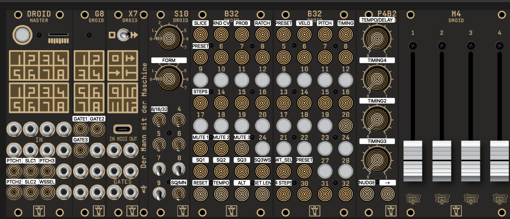

# droid-assimil8or-patch
Droid patch with 3 sequencers.

2 for slicing and sequencing a 1 bar drum loop on Assimil8or using a M4.
1 for algosequencing a wavetable sample.

It provides 16 slices of a 1 bar drumloop using the M4 notches to select a sample start for each of the 16 steps and additionally the rand cv, gate prob, ratchets, velocity, pitch and timing.

Besides a main swing groove using the pots, the 2 drum tracks also have an added delay knob and timing page to adjust the groove of each 4 16th steps in each quarter note.

You can also use the M4 to sequence your presets for each drum sequencer and use the switch between the sequence or manual mode, similar as the ER101.

